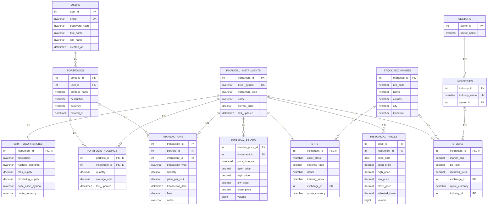

# IPMS Mermaid ERD

Notes:

- This Mermaid ERD matches the current live `IPMS` database schema.
- `REALTIME_PRICE_SNAPSHOTS` is not included because that table does not currently exist in the live database.
- Mermaid already shows cardinality with crow's foot symbols such as `||--o{` and `||--o|`; the added labels make the relationships read more like `1:N` and `1:1`.
